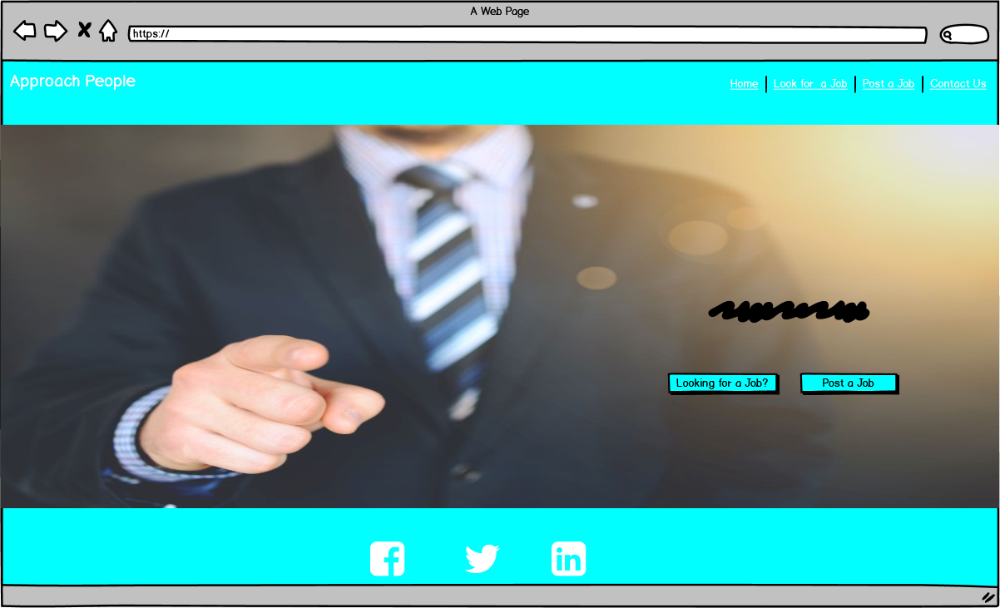

# Approach People

### [Live Heroku App Link](https://approach-people.herokuapp.com/)
### [GitHub repository Link](https://github.com/todorr92/approach_people) 

## Summary
#### Approach People is an application that allows users to post jobs. Each entry can be easily searchable, and also updated or deleted. This project is my third milestone project while studying at Code Institute. The purpose of the milestone project is to utilize a database in a website built with a Python Flask project using Python, HTML, CSS and Javascript.
## Table of Contents
### 1. [UX](#ux)
### 2. [Features](#features)
### 3. [Technologies Applied](#technologies-applied)
### 4. [Tests](#testing) 
### 5. [Deployment](#deployment)
### 6. [Credits](#credits)
# UX
### Project Goal
#### The user's experience was at the front and center during the development of this project. One of the goals of the project was to create an application that is simple and satisfying to use. For this reason, Approach People was built to be usable across all screen sizes.
### User Stories
* As a user, I want to check out posted jobs.
* As a user, I want to post certain jobs, and get ideal candidates.
* As a user, I want to update a job, if some details were changed.
* As a user, I want to be able to delete a job, if it is not longer relevant
* As a user, I want to search through entries I have created, to find a specific item.
* As a user, I want to be able to upload images of company logos, so that they are easily recognazible.
* As a user, I want to be able to read through my posted jobs on a mobile device, so that I can access the information from anywhere.
### Design Choices
##### The application was built using bootstrap and its responsive grid system. Some of default bootstrap style was overriden by a [style.css](static/css/style.css).
#### Color Scheme
* **Body** - used #e0f2f1 (aqua) for a background color
* **Footer and Nav Bar** - used #17a2b8 (dark blue) as a background color while text color was #F8F8FF (ghost white)
* **Text** - simple #fff (white) color was used for a text to have a nice contrast with background colors
* **Buttons** - For landing buttons darker shade of blue was used (#01a8c1), for submit buttons #17a2b8 (dark blue) and for action buttons such as Apply, Edit Job and Delete #26a69a (dark cyan) were used as primary colors
#### Fonts
* [Do Hyeon](https://fonts.google.com/?query=Do+Hyeon) - used only in project name (Approach People)
* [Noto Sans KR](https://fonts.google.com/?query=Noto+Sans+KR) -  used for rest of the website
## Wireframe Mockups:
#### During the design process I drew up wireframes using [Balsamiq](https://balsamiq.com/)

## Features
### Existing Features
#### Home
* Navigation bar with four links: Home, Look for a Job, Post a Job and Contact Us
* Simple and appealing background image, with two buttons leading to all jobs posted or to post a job
#### Look for Job
* Shows all current jobs posted in a container with a image(company logo) and few job details such as job name, company name, salary, job location, date posted and employment type.
#### Search Jobs
* This feature is designed to take a user's search request and find jobs that contain the search request.
#### Post a Job
* Takes all information in a form, populating DB with information given by user.
#### Job Details
* Goes into more information about specific job clicked by showing job description, job requirements, company telephone number, email address, due date and posted by.
#### Apply
* By clicking on Apply button default mailing service will promt to open with pre set subject and email to address using mailto function.
#### Edit Job
* Takes all information from Mongo DB, once change is made DB is updated.
#### Delete Job
* Deletes a job from DB, but before doing so, pop up modal is triggered asking user to confirm the action.
#### Contact Us
* Contact us form connected with my email address using EmailJS.
#### Error Page
* In case of any error, user will be aware of it.
### Features Left to Implement
* User Authentication
* User profile creating where each user could store their cover letter and CV
* A password recovery system, that would send an email to a user's account, needs to be implemented.
* Implement Cloudinary. Users should be able to upload their own images and the urls should be stored in the database with the job.
## Technologies Applied:
+ HTML, CSS and JavaScript programming languages
+ Python
+ Flask
+ Jinja2 templating language
+ Chrome Developer Tools
+ [Balsamiq](https://balsamiq.com/)
+ [Favicon](https://favicon.io/)
+ [Google Fonts](https://fonts.google.com/) 
+ [Bootstrap](https://getbootstrap.com/) 
+ [Materialize](https://materializecss.com/)
+ [Jquery](https://jquery.com/)  
+ [Github](https://github.com/) 
+ [Gitpod](https://gitpod.io/workspaces/)
+ [EmailJS](https://www.emailjs.com/)
+ [Mockup Generator](https://techsini.com/multi-mockup/index.php)
+ [Heroku](https://dashboard.heroku.com/apps)
+ [MongoDB](https://www.mongodb.com/)
## Testing
#### The test procedures and the key issues of the tests are written in the file [testing.md](testing.md)
## Deployment
### Run this project locally
#### Clone this project from GitHub:
1. Under the repository name, click "Clone or download".
2. In the Clone with HTTPs section, copy the clone URL for the repository.
3. In your local IDE open Git Bash.
4. Change the current working directory to the location where you want the cloned directory to be made.
5. Type git clone, and then paste the URL you copied in Step 3.
6. Press Enter. Your local clone will be created.
##### Next you will need to install all the projects dependencies type - (pip install -r requirements.txt).
##### If you add any new packages to the project use - (pip freeze --local > requirements.txt) to update the [requirements.txt](requirements.txt) file with new dependencies.
#### Environment Variables:
1. In your local IDE you can create an env.py file to store the MONGO_DBNAME, MONGO_URI & SECRET_KEY variables.
2. Add the following code to your env.py and insert your applicable variables.
###### import os
###### os.environ["SECRET_KEY"] = "Your secret key"
###### os.environ["MONGO_URI"] = "Your mongo_uri"
### This website was deployed using Heroku following steps below:
1. Create a new app in Heroku.
2. In the settings tab, set the following config vars.
* MONGO_URI = "Your mongo_uri"
* SECRET_KEY = "Your secret key"
* PORT = 5000
* IP = 0.0.0.0
3. From the heroku dashboard of your application, click on "Deploy" > "Deployment method" and select GitHub.
4. Connect to the appropriate GitHub repository.
5. If you set the project up for automatic deploys it will deploy once the master branch is updated.
6. OR in the manual deployment section, select the master branch and click 'Deploy Branch".
7. The site should be successfully deployed
# Credits
### Content
+ Job specs  were taken from [jobs.ie](https://www.jobs.ie/)
### Media
+ The images used in this site were obtained from [Pexels](https://www.pexels.com/)
+ Favicon used in this site was obtained from [favicon](https://favicon.io/)
### Code Credits
+ [CSS ANIMATED BUTTONS](https://demos.themesfinity.com/css-buttons/) - Button style on landing page
+ Other helpful resources were [w3schools.com](https://www.w3schools.com/), [CSS Gradient](https://cssgradient.io/), [Stack Overflow](https://stackoverflow.com/), [Material Design](https://material.io/), [MDN web docs](developer.mozilla.org), [Stack Abuse](stackabuse.com) and [CSS Tricks](https://css-tricks.com/)
### Acknowledgements
#### I would like to thank my mentor, Akshat Garg for his support, insights and advices. 
#### I would also like to thank Slack community for help provided when needed.
## Disclaimer
#### Please note that content on this website is educational purpose only